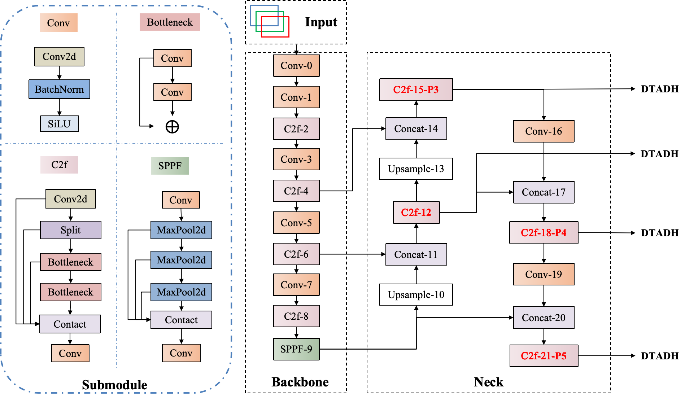
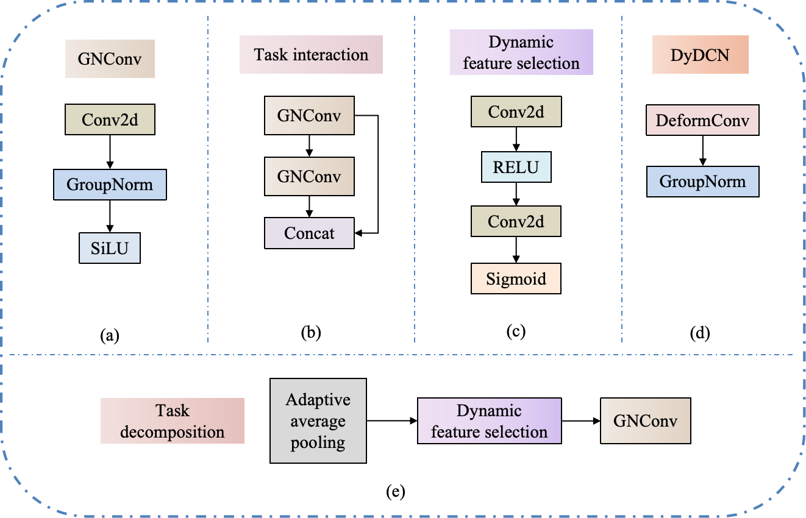
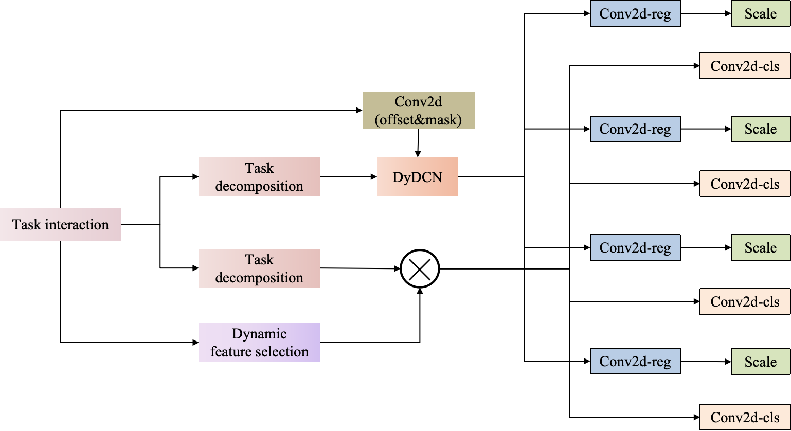
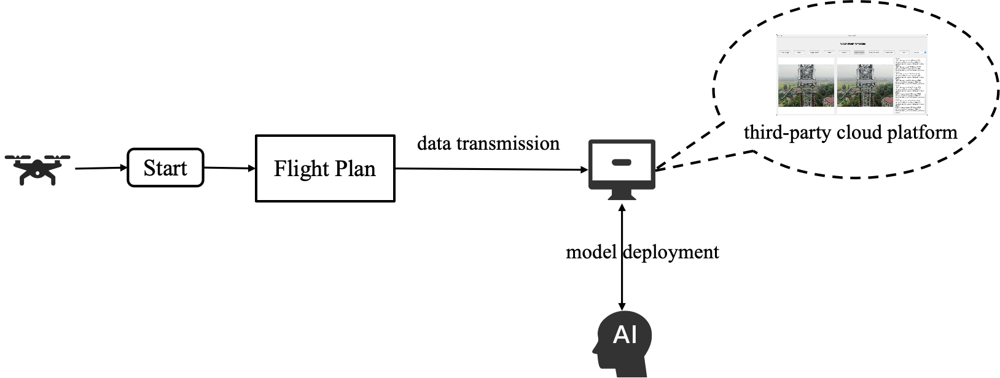
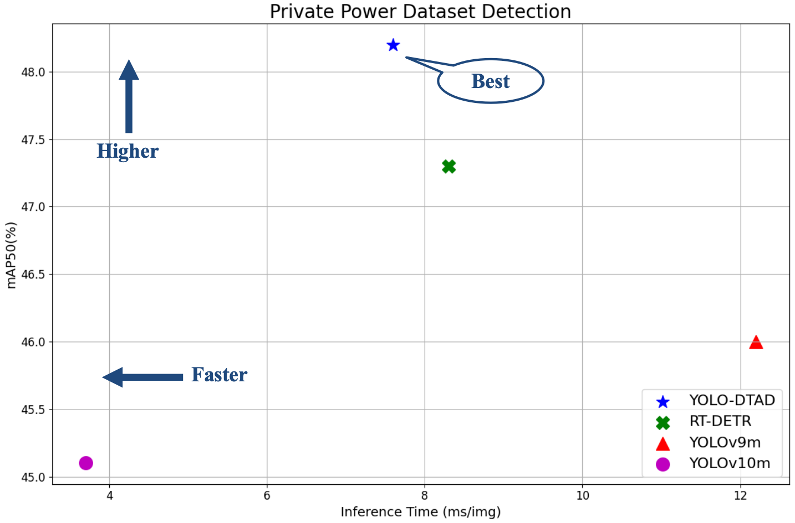
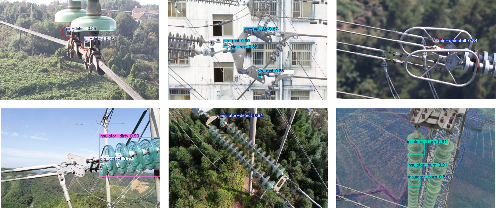

# YOLO-DTAD: Dynamic Task Alignment Detection Model for Multi-Category Power Defects Image

## Introduction
This is our PyTorch implementation of the paper "[`YOLO-DTAD: Dynamic Task Alignment Detection Model for Multi-Category Power Defects Image`](https://ieeexplore.ieee.org/document/10884832)" published in ***IEEE Transactions on Instrumentation and Measurement***.

<div align="center">
    
</div>


## <div align="left">Quick Start Examples</div>

<details open>
<summary>Install</summary>

First, clone the project and configure the environment.

```bash
git clone https://github.com/LiuJiaji1999/yolo-dtad.git 
ultralytics版本为8.1.9,在ultralytics/__init__.py中的__version__有标识.              
pip install -r
    # 3090 单卡
    python: 3.8.18 / 3.8.16
    torch:  1.12.0+cu113 / 1.13.1+cu117
    torchvision: 0.13.0+cu113 / 0.14.1+cu117  
    numpy: 1.22.3
    timm: 0.9.8                 
    mmcv: 2.1.0                
    mmengine: 0.9.0  / 0.10.3    
```

</details>

<details open>
<summary>Train</summary>

```python
python train.py
```
</details>


<details>
<summary>Test</summary>

```bash
python val.py
```
</details>


## EGC Schematic Diagram
The lightweight convolutional module EGC incorporates the design philosophies of GhostNet and C2f modules, significantly enhancing the capture of key information in detection targets through the ECA attention mechanism. The structural diagram of the EGC module is shown below.

<div align="center">
    
</div>

<div align="center">
    
</div>

## Experimental flow chart

<div align="center">
    
</div>


## Detection result
<div align="center">
    
</div>

<div align="center">
    
</div>


### Citation
If you use this code or article in your research, please cite it using the following BibTeX entry:

```bibtex
@ARTICLE{10884832,
  author={Jiao, Runhai and Liu, Jiaji and Li, Kaihang and Qiao, Ruojiao and Liu, Yanzhi and Zhang, Wenbiao},
  journal={IEEE Transactions on Instrumentation and Measurement}, 
  title={YOLO–DTAD: Dynamic Task Alignment Detection Model for Multicategory Power Defects Image}, 
  year={2025},
  volume={74},
  number={},
  pages={1-14},
  keywords={Feature extraction;Head;YOLO;Insulators;Autonomous aerial vehicles;Adaptation models;Accuracy;Location awareness;Inspection;Defect detection;Exponential moving average (EMA);multicategory power defects;single-stage object detection;task interaction},
  doi={10.1109/TIM.2025.3541692}}
```


#### 子目录下的文件说明
```bash
1. train.py ：训练模型的脚本
2. main_profile.py ：输出模型和模型每一层的参数,计算量的脚本
3. val.py ：使用训练好的模型计算指标的脚本
4. detect.py ： 推理的脚本
5. track.py：跟踪推理的脚本
6. test_yaml.py：用来测试所有yaml是否能正常运行的脚本
7. heatmap.py ：生成热力图的脚本
8. get_FPS.py ：计算模型储存大小、模型推理时间、FPS的脚本
    FPS最严谨来说就是1000(1s)/(preprocess+inference+postprocess),
    ✅没那么严谨的话就是只除以inference的时间
9. get_COCO_metrice.py：计算COCO指标的脚本
10. plot_result.py：绘制曲线对比图的脚本
11. transform_PGI.py去掉PGI模块.
12. export.py：  导出onnx脚本.
13. get_model_erf.py ： 绘制模型的有效感受野.
```

#### 注意事项
```shell
1. 执行pip uninstall ultralytics把安装在环境里面的ultralytics库卸载干净.<这里需要注意,如果你也在使用yolov8,最好使用anaconda创建一个虚拟环境供本代码使用,避免环境冲突导致一些奇怪的问题>
2. 卸载完成后同样再执行一次,如果出现WARNING: Skipping ultralytics as it is not installed.证明已经卸载干净.
3. 如果需要使用官方的CLI运行方式,需要把ultralytics库安装一下,执行命令:<pip install -e .>,当然安装后对本代码进行修改依然有效.注意:不需要使用官方的CLI运行方式,可以选择跳过这步
4. 额外需要的包安装命令:
    numpy==1.23.5 albumentations==1.4.2
    pip install timm==0.9.8 thop efficientnet_pytorch==0.7.1 einops grad-cam==1.4.8 dill==0.3.6 albumentations==1.3.1 pytorch_wavelets==1.3.0 -i https://pypi.tuna.tsinghua.edu.cn/simple
    以下主要是使用dyhead必定需要安装的包,如果安装不成功dyhead没办法正常使用!如果执行了还是不成功,可看最下方mmcv安装问题.
        pip install -U openmim
        mim install mmengine -i https://pypi.tuna.tsinghua.edu.cn/simple
        mim install "mmcv>=2.0.0" -i https://pypi.tuna.tsinghua.edu.cn/simple
5.需要编译才能运行的一些模块:mamba、dcnv3、dcnv4

- 成功编译DCNv3 和 DCNv4：

Installed /home/lenovo/anaconda3/envs/ObjectDetection/lib/python3.8/site-packages/DCNv3-1.1-py3.8-linux-x86_64.egg
Processing dependencies for DCNv3==1.1
Finished processing dependencies for DCNv3==1.1


Installed /home/lenovo/anaconda3/envs/ObjectDetection/lib/python3.8/site-packages/DCNv4-1.0.0-py3.8-linux-x86_64.egg
Processing dependencies for DCNv4==1.0.0
Finished processing dependencies for DCNv4==1.0.0

```